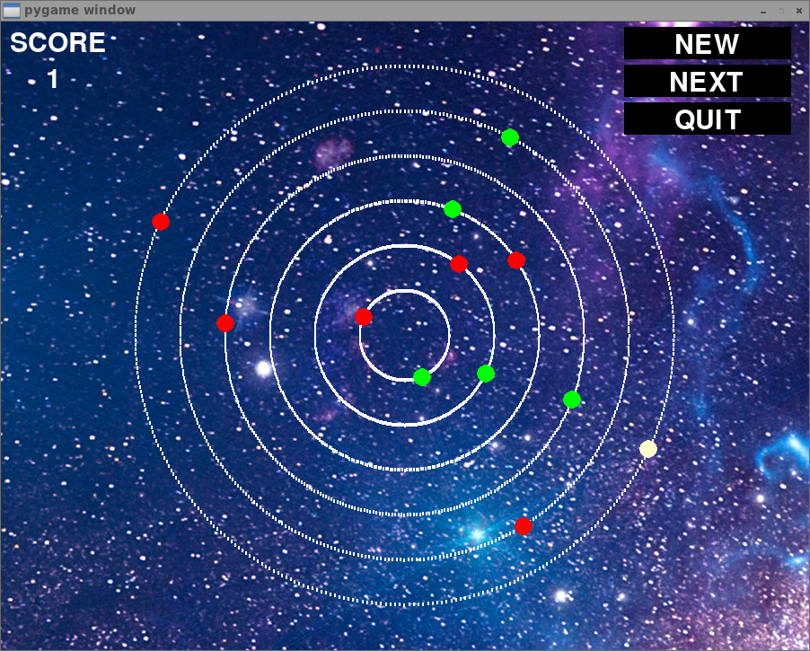

# Orbit  Hunt 'Leaps and Bounds' - Game Off 2019

## Authors
- Jeremy Tsang
- Hae-Ji Park

## Description
Try to grab the green balls before being attacked by the red balls.

## Requirements
Requires PyGame (tested on v. 1.9.6)

## Instructions

### Starting Game
Run game by either running
```
python main.py
```
or 
```
chmod u+x main.py  # Only needs to be executed once
./main.py          # Run everytime starting game
```
### Controls
|-------|-----------------------|
| key   | description           |
|-------|-----------------------|
| UP    | jump to outer orbits  |
| DOWN  | jump to inner orbits  |
| LEFT  | move counterclockwise |
| RIGHT | move clockwise        |
|-------|-----------------------|

## Screenshot or Video
- screenshot


- [example gameplay](https://youtu.be/BchZFLCxLR0)
